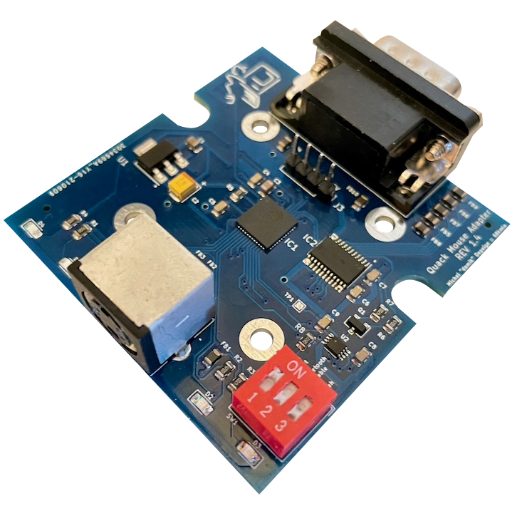

# Quack Mouse Converter   [![Badge License]][License]

A dongle that allows various retro systems to use the `Apple Desktop Bus`  
as well as `Bluetooth 2+` mice through their `quadrature` mouse ports.

 
 
 

[![Button Documentation]][Documentation]   
[![Button Firmware]][Firmware]   
[![Button PCB]][PCB]   
[![Button Changelog]][Changelog]

 
 

 
 

## Supported

#### Systems

<kbd>  Macintosh 128 / 512 / Plus  </kbd>  <kbd>  Apple Lisa  </kbd>

#### Connection Types

<kbd>  Apple Desktop Bus  </kbd>  <kbd>  Bluetooth 2+  </kbd>

 
 

### Unsupported

- `ADB`  ➞  `Bluetooth LE` for **Non-Windows 10**

 

<!----------------------------------------------------------------------------->

[Documentation]: https://github.com/demik/quack/wiki

[Changelog]: ChangeLog.md
[Firmware]: main/README.md
[License]: LICENSE
[PCB]: EDA/ChangeLog.md

<!-------------------------------[ Badges ]----------------------------------->

[Badge License]: https://img.shields.io/badge/License-Apache_2.0-961b1f?style=for-the-badge&labelColor=D22128

<!-------------------------------[ Buttons ]----------------------------------->

[Button Documentation]: https://img.shields.io/badge/Documentation-0099E5?style=for-the-badge&logoColor=white&logo=BookStack
[Button Changelog]: https://img.shields.io/badge/Changelog-21375A?style=for-the-badge&logoColor=white&logo=AzureArtifacts
[Button Firmware]: https://img.shields.io/badge/Firmware-E5426E?style=for-the-badge&logoColor=white&logo=ROS
[Button PCB]: https://img.shields.io/badge/PCB-007c40?style=for-the-badge&logoColor=white&logo=PowerApps
